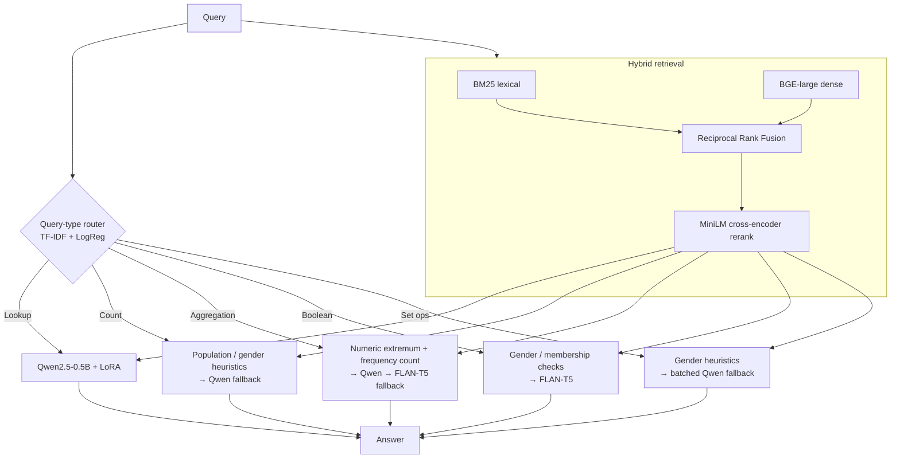

# Evidence-Based Question Answering — RAG + Small-LM Pipeline

> **ADM & LT 2025/2026 Hackathon** — Team *Los Pollos Hermanos*
> A query-type-aware retrieval-augmented pipeline that answers natural-language
> questions over a per-database corpus of **synthetic** facts.


---

## Overview

The task is evidence-based QA: for each question we must derive the answer **only**
from the facts of the referenced evidence database (`db_id`). Every entity name has
been replaced with a synthetic token absent from any pre-training corpus, so the
generator cannot answer from parametric memory — the answer must come from
**retrieval + reasoning over the evidence**.

Five query types must be handled, each evaluated with its own metric:

| Query type    | Answer format                       | Metric        |
|---------------|-------------------------------------|---------------|
| `Lookup`      | single string                       | exact match   |
| `Aggregation` | single string                       | exact match   |
| `Count`       | integer as string (e.g. `3`)        | accuracy      |
| `Boolean`     | `yes` / `no`                        | accuracy      |
| `Set ops`     | JSON list of strings (`["a","b"]`)  | set-based F1  |

The final score is the **unweighted macro-average** across the five types.

## Design principles

1. **No single generic answerer.** Each query type has a different structure, so the
   pipeline routes every question to specialised logic.
2. **Retrieval quality first.** The evidence space is reduced through lexical search,
   dense retrieval, rank fusion and reranking before any generation happens.
3. **Models *and* deterministic rules.** Some queries need flexible text understanding;
   others need strict operations (counting, numeric comparison, controlled-format sets).
   Heuristics run first and a language model is the fallback.

## Architecture



**Components**

| Stage       | Model / method                              | Size   |
|-------------|---------------------------------------------|--------|
| Router      | TF-IDF (1–2 grams) + Logistic Regression    | —      |
| Dense retr. | `BAAI/bge-large-en-v1.5`                     | 335M   |
| Reranker    | `cross-encoder/ms-marco-MiniLM-L-12-v2`     | 33M    |
| Generator A | `Qwen/Qwen2.5-0.5B-Instruct` + LoRA adapter | 0.5B   |
| Generator B | `google/flan-t5-base`                       | 250M   |

The LoRA adapter is fine-tuned on `Lookup` / `Count` / `Set ops` training examples,
pairing BM25-selected top facts with the gold answer under a query-type-specific
system prompt.

## Repository structure

```
adm-lt-hackathon-qa/
├── README.md
├── LICENSE
├── requirements.txt
├── Notebook_NLP_LOSPOLLOSHERMANOS.ipynb   # end-to-end pipeline
└── report/
    └── LOS_POLLOS_HERMANOS.pdf            # written report
```

The whole system lives in a single, self-contained notebook: data loading,
retrieval, LoRA fine-tuning, dev-set evaluation and submission generation.

## How to run

The notebook was developed and run on **Kaggle with a Tesla T4 GPU**.

1. Open `Notebook_NLP_LOSPOLLOSHERMANOS.ipynb` on Kaggle (or in Jupyter with a GPU).
2. Attach the competition dataset and the LoRA adapter dataset as inputs. The first
   cells auto-discover the data, evidence corpus and adapter under `/kaggle/input`.
3. Run the cells top to bottom. The dependency install is handled by the first cell:

   ```python
   !pip install polars rank_bm25 transformers peft accelerate \
                scikit-learn sentence-transformers sentencepiece -q
   ```

   For a local environment, `requirements.txt` lists the same stack (add `trl` and
   `datasets`, already included, for the LoRA fine-tuning cell).

### Expected input layout

```
/kaggle/input/
├── <competition>/
│   ├── train.parquet
│   ├── dev.parquet
│   ├── test.csv
│   ├── sample_submission.csv
│   └── evidence_corpus/
│       ├── db_0.jsonl
│       └── ...
└── <lora-adapter-dataset>/      # adapter_config.json + adapter weights
```

### Notebook flow

| Cell(s) | Purpose |
|---------|---------|
| 1–2     | Install dependencies and imports |
| 3–4     | Locate inputs; load train/dev/test and the evidence corpus |
| 5       | LoRA fine-tuning of the Qwen component (documented / reproducible) |
| 6–7     | Load models (BGE, MiniLM, FLAN-T5, Qwen+LoRA); train the router |
| 8–9     | Utility functions and per-query-type answer functions |
| 10      | Precompute corpus embeddings |
| 11      | Dev-set evaluation with the query-type-aware metric |
| 12      | Test-set inference and submission file |

## Evaluation

Cell 11 prints a per-type breakdown and the macro-average on the dev set:

| Query type    | Metric       | Dev score |
|---------------|--------------|-----------|
| Lookup        | exact match  | _TODO_    |
| Aggregation   | exact match  | _TODO_    |
| Count         | accuracy     | _TODO_    |
| Boolean       | accuracy     | _TODO_    |
| Set ops       | set F1       | _TODO_    |
| **Macro avg** |              | **_TODO_**|

> Fill in the numbers from your own run — they are intentionally left blank here
> rather than hard-coded.

## Team

- **Denise Brancaleone** (2048469)
- **Matías Cerda** (2242483)
- **Gabriele Manfrè** (1959815)
- **Gianluca Pasquinelli** (2075459)

## License

Released under the [MIT License](LICENSE).
